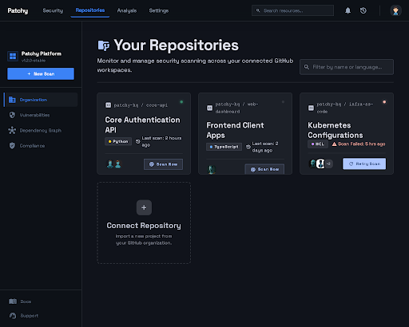
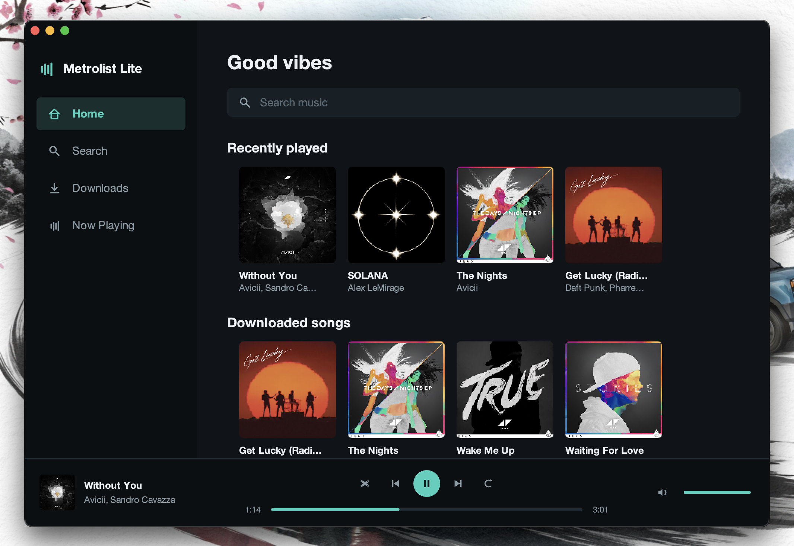

<picture>
  <source media="(prefers-color-scheme: dark) and (max-width: 600px)" srcset="./assets/header-dark-mobile.svg">
  <source media="(prefers-color-scheme: light) and (max-width: 600px)" srcset="./assets/header-light-mobile.svg">
  <source media="(prefers-color-scheme: dark)" srcset="./assets/header-dark.svg">
  <source media="(prefers-color-scheme: light)" srcset="./assets/header-light.svg">
  
</picture>

 

I build software across **AI, security, and developer tooling**. I like understanding how systems work, finding where they break, and turning that knowledge into useful tools.

Good engineering, to me, means clear interfaces, careful trade-offs, and code that's easier to work with than work around.

### Languages

<picture>
  <source media="(prefers-color-scheme: dark)" srcset="./assets/tech/languages-dark.svg">
  
</picture>

### Tools & platforms

<picture>
  <source media="(prefers-color-scheme: dark)" srcset="./assets/tech/tools-dark.svg">
  
</picture>

### Selected projects

#### [FlagArena](https://github.com/error9098x/FlagArena)

A self-hosted CTF platform for security communities. Create challenges, run events, and keep practice progress separate from competition results.

#### [Patchy](https://github.com/error9098x/Patchy)

An AI-assisted security bot that scans GitHub repositories, proposes fixes, and creates pull requests for review.

#### [Metrolist Lite](https://github.com/error9098x/metrolist-lite)

My macOS desktop fork of Metrolist, with YouTube Music playback, synced lyrics, and offline downloads.

### Contribution activity

<picture>
  <source media="(prefers-color-scheme: dark)" srcset="./assets/contribution-snake-dark.svg">
  
</picture>

### Languages in my public repositories

<picture>
  <source media="(prefers-color-scheme: dark)" srcset="https://github-stats-extended.vercel.app/api/top-langs/?username=error9098x&amp;layout=compact&amp;langs_count=8&amp;theme=dark&amp;hide_border=true">
  
</picture>

 

[Explore all repositories](https://github.com/error9098x?tab=repositories)
