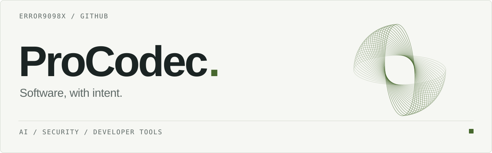

<picture>
  <source media="(prefers-color-scheme: dark) and (max-width: 600px)" srcset="./assets/header-dark-mobile.svg">
  <source media="(prefers-color-scheme: light) and (max-width: 600px)" srcset="./assets/header-light-mobile.svg">
  <source media="(prefers-color-scheme: dark)" srcset="./assets/header-dark.svg">
  <source media="(prefers-color-scheme: light)" srcset="./assets/header-light.svg">
  
</picture>

 

I build software across **AI, security, and developer tooling**. I like understanding how systems work, finding where they break, and turning that knowledge into useful tools.

Good engineering, to me, means clear interfaces, careful trade-offs, and code that's easier to work with than work around.

### Selected work

| Project | What it's about |
| :--- | :--- |
| **[FlagArena](https://github.com/error9098x/FlagArena)** | A self-hosted CTF platform for challenges, practice, and security events. |
| **[Patchy](https://github.com/error9098x/Patchy)** | AI-assisted security scanning and patch generation for GitHub repositories. |
| **[OP-AgentBench](https://github.com/error9098x/op-agentbench)** | An Open Payments reference agent and early work on payment-agent safety evaluation. |

  
Languages &amp; tools

   

  **Languages** &nbsp; TypeScript · Python · JavaScript

  **Tools & platforms** &nbsp; Git · Node.js · Flask · PostgreSQL

 

[Explore repositories](https://github.com/error9098x?tab=repositories) &nbsp;·&nbsp; [Recent activity](https://github.com/error9098x?tab=overview)
